# Popcornly

Popcornly is a fullstack mobile movie discovery app built with Expo + React Native.
It combines TMDB content APIs with Firebase Auth + Firestore to deliver:

1. Movie and TV browsing
2. Global search across movie and TV
3. Save-to-favorites per user account
4. Trending content powered by Firestore search metrics
5. AI recommendations via secure server-side OpenAI proxy

## Tech Stack

1. Frontend: Expo, React Native, Expo Router, TypeScript
2. Data Fetching: TanStack React Query
3. Backend Services: Firebase Auth + Firestore
4. External API: TMDB (The Movie Database)
5. Lists/Media: FlashList, expo-image
6. Validation/Config: Zod-based env parsing

## App Features

1. Authentication
2. Home (trending + latest rails)
3. Movies tab (trending/latest + infinite pagination)
4. TV Shows tab (trending/latest + infinite pagination)
5. Search (debounced, unified movie + TV)
6. Details pages (movie + tv, in-app trailers, where-to-watch by country)
7. Saved favorites per user
8. Profile and account actions
9. AI recommendations in Home (`For You`) based on user favorites

## AI Recommendations: How It Works

The recommendation flow is intentionally split into two layers:

1. Recommendation generation:
   1. App sends user context (favorites, optional recent searches, country).
   2. Backend proxy (Firebase Function) calls OpenAI and returns structured picks:
      1. `title`
      2. `mediaType` (`movie` | `tv` | `any`)
      3. `reason`
2. Content enrichment:
   1. App resolves AI titles against TMDB search endpoints.
   2. It maps each recommendation to actual content cards (poster, id, route target).
3. Home rendering:
   1. `For You (AI)` appears for logged-in users.
   2. If user has no favorites, it shows a guidance state.
   3. If AI is unavailable, it fails gracefully with fallback messaging.

## What Was Added In This Phase

1. Secure AI architecture:
   1. Firebase Function OpenAI proxy (`functions/src/index.js`)
   2. Secret-based key handling (`OPENAI_API_KEY`) for production mode
2. Client recommendation service:
   1. `services/recommendations.ts` for endpoint call + TMDB enrichment
   2. Robust parsing of OpenAI response output structures
3. Home integration:
   1. New `For You (AI)` rail in Home
   2. Favorite-driven recommendation queries
4. Details experience upgrades:
   1. In-app trailer playback
   2. YouTube fallback when embedded trailer is blocked
   3. Where-to-watch providers by country (stream/rent/buy)

## Screenshots

<div align="center" style="display: flex; flex-wrap: wrap; gap: 16px; justify-content: center;">

  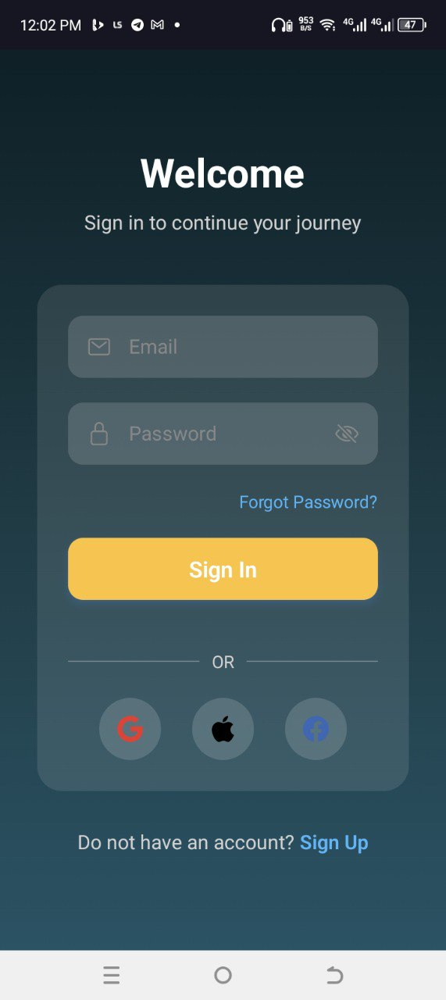
  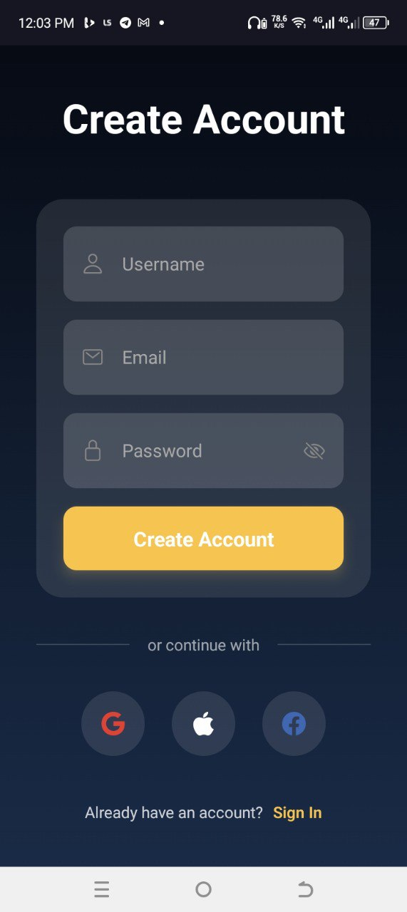
  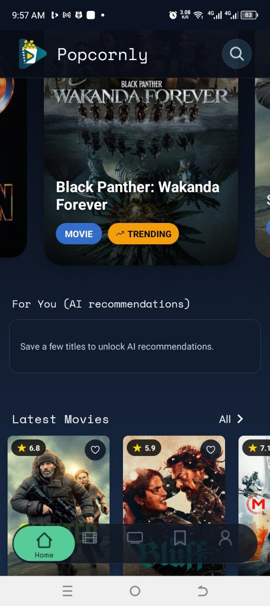
  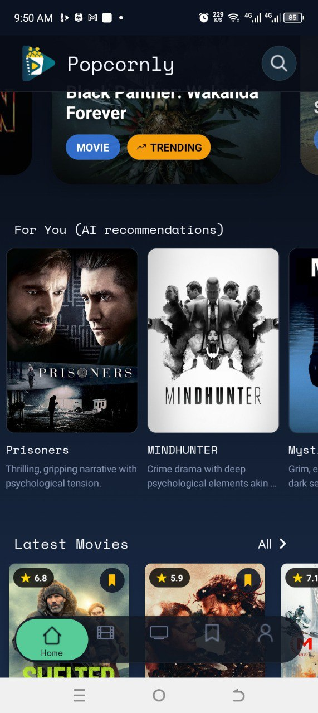
  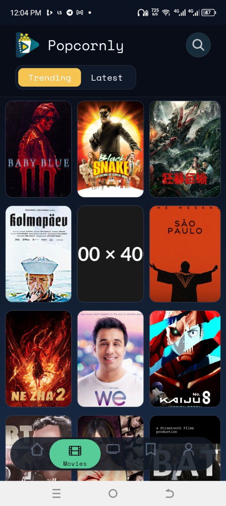
  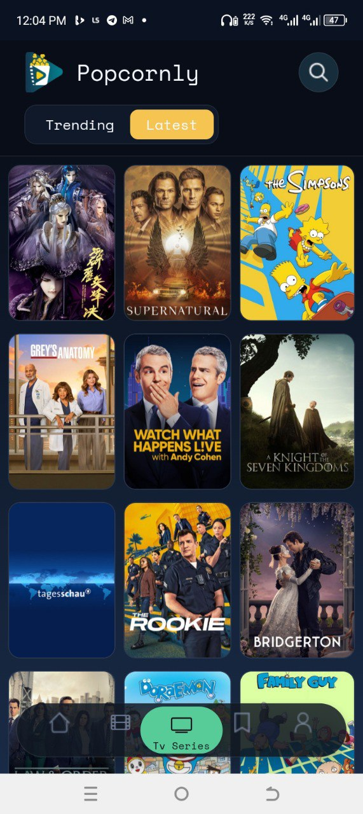
  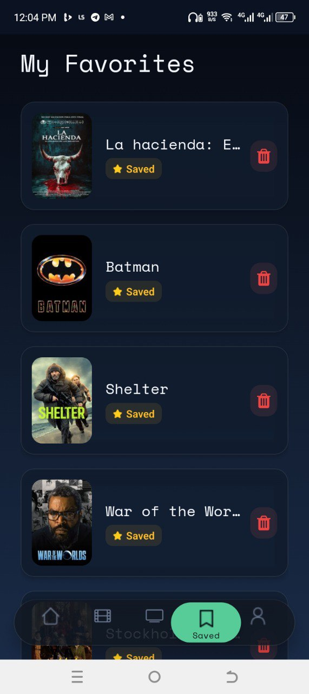
  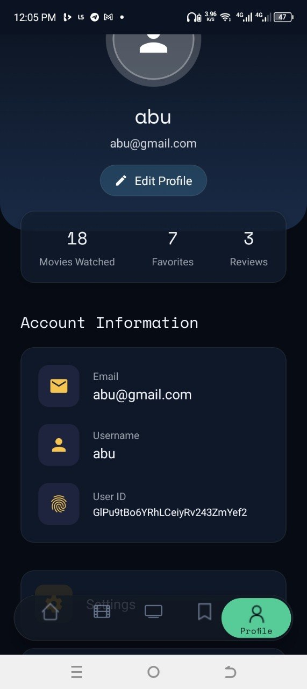
  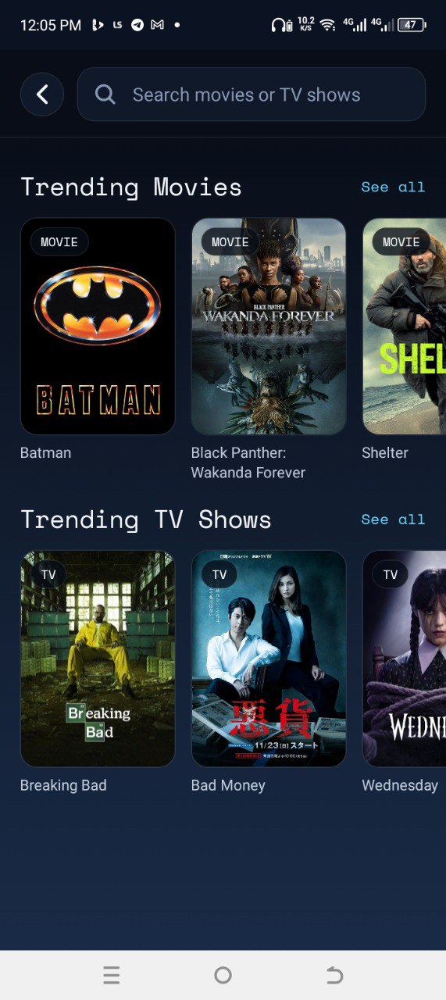
  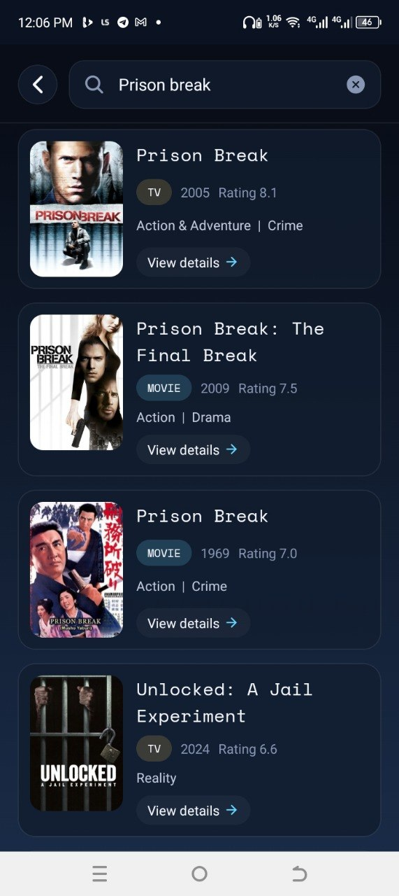
  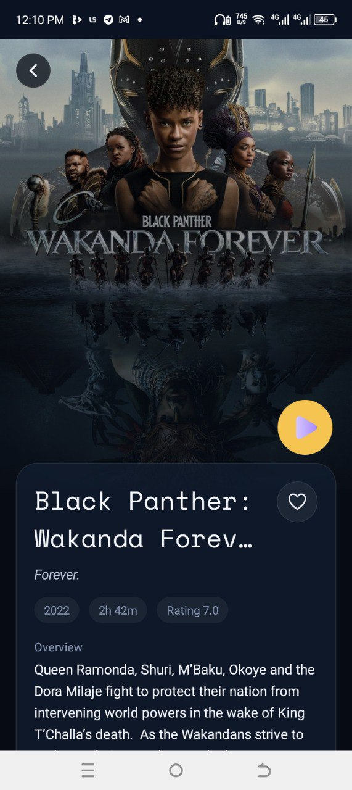
  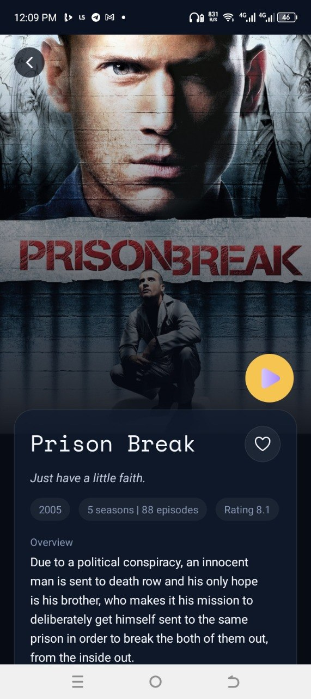

</div>

## Architecture

High-level flow:

1. Client app (Expo/React Native) handles UI and routing
2. React Query handles caching and async state
3. Firebase Auth handles identity (email/password + Google)
4. Firestore stores `users`, `favorites`, `metrics`, and `tvMetrics`
5. TMDB provides movie and TV metadata

See [Architecture Notes](./docs/ARCHITECTURE.md).

## Getting Started

1. Install dependencies

```bash
npm install
```

2. Copy env template

```bash
copy .env.example .env
```

3. Fill `.env` with your real credentials

4. Run app

```bash
npx expo start
```

Useful commands:

```bash
npm run lint
npx tsc --noEmit
npm run test:firestore-rules
npm run test:services
npm run test:integration
npm run android
npm run ios
```

## Environment Variables

Use `.env.example` as the reference for required variables.

Never commit real secrets.

OpenAI recommendation endpoint (optional until deployed):

```env
EXPO_PUBLIC_RECOMMENDER_ENDPOINT=
```

Demo-only fallback (not for production):

```env
EXPO_PUBLIC_ENABLE_CLIENT_AI_DEMO=false
EXPO_PUBLIC_OPENAI_API_KEY=
```

Behavior by configuration:

1. `EXPO_PUBLIC_RECOMMENDER_ENDPOINT` set:
   1. App uses server-side Firebase Function proxy (recommended).
2. `EXPO_PUBLIC_RECOMMENDER_ENDPOINT` empty + `EXPO_PUBLIC_ENABLE_CLIENT_AI_DEMO=true`:
   1. App uses demo-only direct client OpenAI mode (for temporary situations).
3. Neither configured:
   1. App still works fully, AI rail shows graceful no-data/fallback state.

## Firestore Setup

Backend config files used by this app:

1. `firestore.rules`
2. `firestore.indexes.json`
3. `firebase.json`

### Index Coverage

Current composite index:

1. Collection: `favorites`
2. Fields: `userId` ascending + `savedAt` descending
3. Purpose: user-scoped favorites list sorted by latest saved

### Deploy Firestore Config

```bash
firebase deploy --only firestore:rules
firebase deploy --only firestore:indexes
```

### Manual Security Validation 

1. Start Firestore emulator:

```bash
firebase emulators:start --only firestore
```

2. Validate key scenarios:
1. User can read/write only their own `users/{uid}`.
2. User can only create/read/delete their own `favorites` docs.
3. `metrics`/`tvMetrics` writes require auth and valid schema.
4. Unknown collections are denied by default.

See detailed security checklist in [Security Notes](./docs/SECURITY.md).

### Automated Firestore Rules Tests

Rules are tested with `@firebase/rules-unit-testing` against the Firestore emulator.
Java is required for local emulator runtime.

Run locally:

```bash
npm run test:firestore-rules
```

What is validated:

1. Favorites ownership checks (create/read/delete scope).
2. User profile ownership + immutable field protection.
3. Metrics schema checks and controlled `count` increments.
4. Unauthenticated write denial.

### Service-Layer Unit Tests

Service tests run with `tsx` + Node test runner and mocked fetch responses.

Run locally:

```bash
npm run test:services
```

Covered modules:

1. `services/api.ts`
2. `services/recommendations.ts`

Validated behavior includes:

1. TMDB mapping and defensive parsing (`results` missing, error paths).
2. Trailer key selection logic.
3. Watch-provider fallback handling.
4. AI recommendation parsing and enrichment flow (endpoint mode and demo mode).

### Integration Test: Auth + Favorites Flow

Integration coverage runs against Firestore emulator with authenticated and unauthenticated contexts.

Run locally:

```bash
npm run test:integration
```

Flow validated:

1. Authenticated user can create own profile doc.
2. Authenticated user can add/list/delete own favorites.
3. Cross-user favorites read is denied.
4. Unauthenticated favorites write is denied.

## OpenAI Recommender Setup (Server-Side)

This app uses a Firebase Function proxy so OpenAI keys never ship in the mobile client.

1. Install function dependencies

```bash
cd functions
npm install
```

2. Set secret key for functions

```bash
firebase functions:secrets:set OPENAI_API_KEY
```

3. Deploy functions

```bash
firebase deploy --only functions
```

4. Copy deployed URL into app `.env`

```env
EXPO_PUBLIC_RECOMMENDER_ENDPOINT=https://<region>-<project>.cloudfunctions.net/recommendations
```

### Temporary Demo Mode (No Blaze Upgrade)

If you cannot deploy Firebase Functions yet, you can enable client-side AI only for your own usage only but not recommended for production:

```env
EXPO_PUBLIC_ENABLE_CLIENT_AI_DEMO=true
EXPO_PUBLIC_OPENAI_API_KEY=<your-openai-key>
EXPO_PUBLIC_RECOMMENDER_ENDPOINT=
```

Then restart:

```bash
npx expo start -c
```

Important: this exposes your OpenAI key in the client bundle. Use only for temporary situations, then disable it and remove the key.

## AI Testing Checklist

1. Sign in with a user account.
2. Save at least 3-5 titles to favorites.
3. Open Home and verify `For You (AI)` appears.
4. Tap a recommendation and confirm navigation to details works.
5. Pull-to-refresh Home and confirm recommendation refresh behavior.
6. Remove favorites and verify the empty guidance state.

## Production Readiness (In Progress)

Track progress in:

1. [TodoChecklist](./docs/TODO_CHECKLIST.md)
2. [Architecture Notes](./docs/ARCHITECTURE.md)
3. [Security Notes](./docs/SECURITY.md)

## Folder Structure

```text
app/              # expo-router pages/routes
components/       # reusable UI components
constants/        # styles, assets maps, query keys
contexts/         # auth and favorites contexts
services/         # TMDB + Firestore service layer
config/           # env parsing and config
types/            # TypeScript models
scripts/          # project scripts
functions/        # Firebase Functions (OpenAI proxy)
docs/             # architecture, security, todo_checklist docs
```

## Project Notes

This project demonstrates:

1. Fullstack integration with Firebase and TMDB
2. Real-time user data (favorites + metrics)
3. Typed service layer + env validation
4. Mobile-first UX with modern navigation and list performance

## License

Personal portfolio project.


