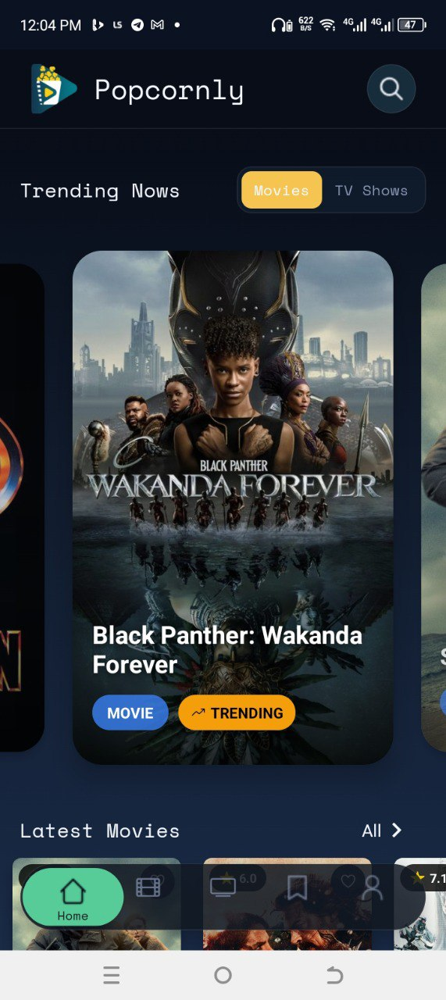

# Popcornly

Popcornly is a fullstack mobile movie discovery app built with Expo + React Native.
It combines TMDB content APIs with Firebase Auth + Firestore to deliver:

1. Movie and TV browsing
2. Global search across movie and TV
3. Save-to-favorites per user account
4. Trending content powered by Firestore search metrics

## Tech Stack

1. Frontend: Expo, React Native, Expo Router, TypeScript
2. Data Fetching: TanStack React Query
3. Backend Services: Firebase Auth + Firestore
4. External API: TMDB (The Movie Database)
5. Lists/Media: FlashList, expo-image
6. Validation/Config: Zod-based env parsing

## App Features

1. Authentication
2. Home (trending + latest rails)
3. Movies tab (trending/latest + infinite pagination)
4. TV Shows tab (trending/latest + infinite pagination)
5. Search (debounced, unified movie + TV)
6. Details pages (movie + tv)
7. Saved favorites per user
8. Profile and account actions

## Screenshots

<div align="center" style="display: flex; flex-wrap: wrap; gap: 16px; justify-content: center;">

  
  
  
  
  
  
  
  
  
  
  

</div>

## Architecture

High-level flow:

1. Client app (Expo/React Native) handles UI and routing
2. React Query handles caching and async state
3. Firebase Auth handles identity (email/password + Google)
4. Firestore stores `users`, `favorites`, `metrics`, and `tvMetrics`
5. TMDB provides movie and TV metadata

See [Architecture Notes](./docs/ARCHITECTURE.md).

## Getting Started

1. Install dependencies

```bash
npm install
```

2. Copy env template

```bash
copy .env.example .env
```

3. Fill `.env` with your real credentials

4. Run app

```bash
npx expo start
```

Useful commands:

```bash
npm run lint
npx tsc --noEmit
npm run android
npm run ios
```

## Environment Variables

Use `.env.example` as the reference for required variables.

Never commit real secrets.

## Firestore Setup

Starter backend files added:

1. `firestore.rules`
2. `firestore.indexes.json`
3. `firebase.json`

Deploy after review:

```bash
firebase deploy --only firestore:rules
firebase deploy --only firestore:indexes
```

## Production Readiness (In Progress)

Track progress in:

1. [Portfolio Checklist](./docs/PORTFOLIO_CHECKLIST.md)
2. [Architecture Notes](./docs/ARCHITECTURE.md)
3. [Security Notes](./docs/SECURITY.md)

## Folder Structure

```text
app/              # expo-router pages/routes
components/       # reusable UI components
constants/        # styles, assets maps, query keys
contexts/         # auth and favorites contexts
services/         # TMDB + Firestore service layer
config/           # env parsing and config
types/            # TypeScript models
scripts/          # project scripts
docs/             # architecture, security, portfolio docs
```

## Portfolio Notes

This project demonstrates:

1. Fullstack integration with Firebase and TMDB
2. Real-time user data (favorites + metrics)
3. Typed service layer + env validation
4. Mobile-first UX with modern navigation and list performance

## License

Personal portfolio project.
